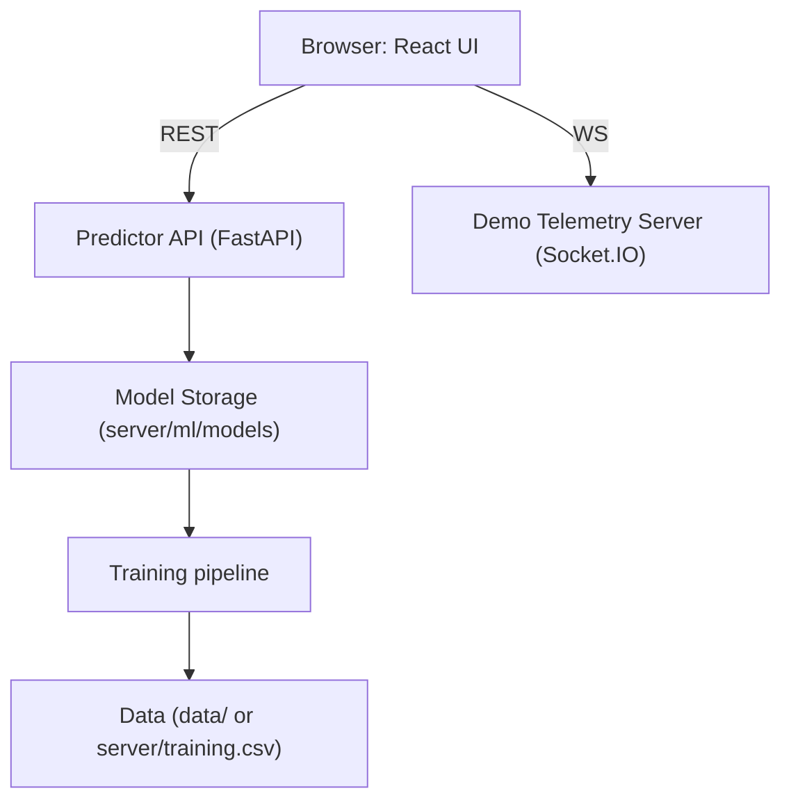

# Madurai Insights Hub

Madurai Insights Hub is a city-telemetry dashboard and ML prediction platform that demonstrates ingestion, visualization and prediction for municipal telemetry (traffic, pollution, energy, waste). It includes a rich React frontend, optional realtime demo server, and a Python-based ML prediction scaffold.

## Table of Contents
- [Overview](#overview)
- [Features](#features)
- [Tech Stack](#tech-stack)
- [System Architecture](#system-architecture)
- [Getting Started](#getting-started)
  - [Frontend](#frontend)
  - [Realtime demo (optional)](#realtime-demo-optional)
  - [ML training & Predictor API](#ml-training--predictor-api)
- [Development](#development)
- [Deployment](#deployment)
- [Testing & CI](#testing--ci)
- [Contributing](#contributing)
- [License & Contact](#license--contact)

## Overview

This repository provides an end-to-end prototype for city telemetry analytics and predictions:
- Interactive map visualizations (Leaflet)
- Real-time telemetry demo via Socket.IO
- Client-side TF.js predictor prototype and server-side Python predictor (FastAPI + scikit-learn)
- Data ingestion helpers and synthetic data generator for experimentation

## Features

- Map layers: Traffic, Pollution, Energy, Waste, Predictions
- Marker clustering, heatmaps, popups with sensor metadata
- CSV export & PDF snapshot reporting
- Realtime demo server to simulate live telemetry
- ML training pipeline and server predictor with Docker scaffold

## Tech Stack

- Frontend: React, TypeScript, Vite, Tailwind CSS
- Mapping: Leaflet, react-leaflet
- Realtime: Socket.IO (Node.js server + socket.io-client)
- ML (client): TensorFlow.js (demo)
- ML (server): Python, pandas, scikit-learn, joblib, FastAPI
- Containerization: Docker
- Deployment targets: Vercel (frontend), any container host for predictor (Render, Railway, AWS, GCP)

## System Architecture

High-level components:

- Frontend (React): UI, Map, CSV/PDF exports, calls predictor API
- Websocket Demo (Node): emits telemetry to frontend clients for demo/live view
- ML Training (Python): data generation, feature engineering, model training (joblib)
- Predictor API (FastAPI): loads trained model(s) and serves predictions

Mermaid diagram (GitHub-friendly flowchart):



Security & infra notes:
- Use HTTPS for API endpoints and set CORS appropriately
- Add authentication for write or sensitive endpoints
- Monitor model drift and input validation

## Getting Started

Clone the repo and install frontend dependencies:

```bash
git clone <your-repo-url>
cd madurai-insights-hub
npm install
```

### Frontend

Start dev server:

```bash
npm run dev
# open http://localhost:5173 (or printed URL)
```

Build for production:

```bash
npm run build
```

### Realtime demo (optional)

Start demo websocket server (Node.js):

```bash
npm run ws-server
```

### ML training & Predictor API

1. Create and activate a Python venv (Windows example):

```bash
python -m venv .venv
.venv\\Scripts\\activate
```

2. Install requirements and extras:

```bash
pip install -r server/predict_api/requirements.txt
pip install scikit-learn pandas joblib
```

3. Generate synthetic data and train a baseline model:

```bash
python server/ml/generate_synthetic.py
python server/ml/train.py
# models saved to server/ml/models/
```

4. Run FastAPI predictor locally:

```bash
uvicorn server.predict_api.main:app --reload --port 8081
# Health: GET /health
# Predict: POST /predict
```

Set `VITE_PREDICTOR_URL` in `.env` or Vercel environment variables to point the frontend to your predictor.

## Development

- Key frontend files: `src/pages/Map.tsx`, `src/components`, `src/ml/predictor.ts`
- Server demo: `server/socket-server.js`
- ML: `server/ml/generate_synthetic.py`, `server/ml/train.py`

### Useful commands

```bash
npm run dev        # start frontend
npm run build      # production build
npm run ws-server  # start telemetry demo server
```

## Deployment

- Frontend: Deploy to Vercel (recommended) or static hosting.
- Predictor: Build Docker image from `server/predict_api/Dockerfile` and deploy to any container host.

Example Docker build (from repo root):

```bash
docker build -t madurai-predictor -f server/predict_api/Dockerfile server/predict_api
docker run -p 8081:8081 madurai-predictor
```

## Testing & CI

- Add GitHub Actions to run `npm ci && npm run build` and any linters/tests.
- Add Python workflow to validate ML requirements and run model sanity checks if included.

## Contributing

Contributions welcome. Recommended workflow:

1. Fork
2. Create feature branch
3. Open PR with description and changes

Please include reproducible steps for data/model changes and add tests where applicable.

## License & Contact

This repository does not include a license file by default. Add a `LICENSE` if you want to open-source the project.

Maintainer: Yogeshwaran (update contact info as desired)

---

If you'd like, I can also:
- Run a local training run and confirm saved models
- Add a GitHub Actions workflow to run builds/tests
- Commit and push this updated README to the repository remote

File: README.md — crafted to give new contributors a full-from-scratch → production view.
